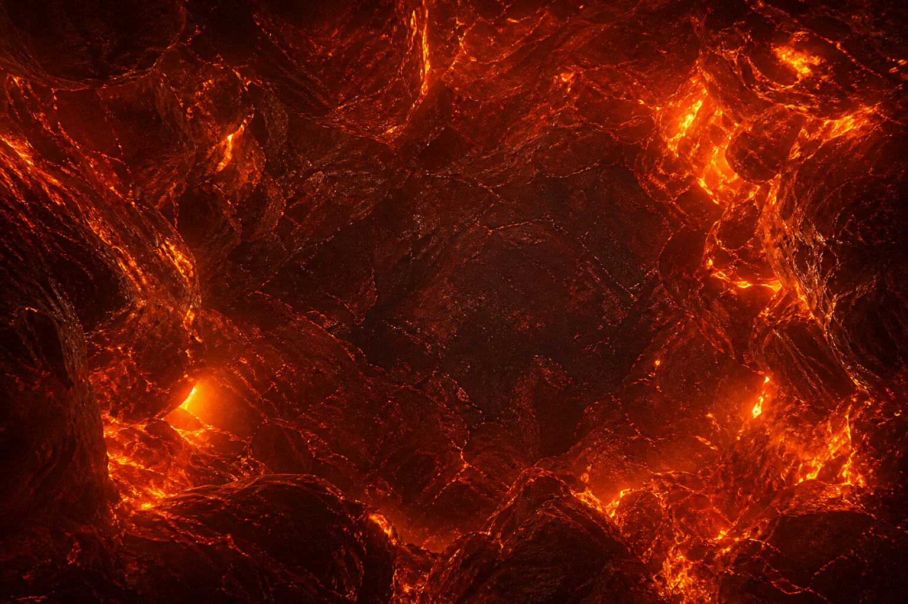

# Prodiam: The Oldest Thing You'll Ever Own

An open-source, scroll-driven WebGL experience about the deep-time history of a diamond. It follows a natural diamond from its formation up to three billion years ago, 150km inside the Earth, through a volcanic ascent, a South African mine, and the cutter's bench, to a finished ring. The hero diamond morphs from a rough crystal into a polished brilliant as you scroll.



## Live

Live at **https://www.prodiam.co.za/oldest/**

## Run locally

```
npm install
npm run dev
```

Then open http://localhost:5180

## Build

```
npm run build      # type-checks, then outputs static files to dist/
npm run preview
```

## Embed

The build is self-contained and iframe friendly:

```
<iframe src="https://YOUR-DEPLOY-URL/" width="100%" height="720" style="border:0" loading="lazy" title="The Oldest Thing You'll Ever Own"></iframe>
```

## Tech

- [Three.js](https://threejs.org) for the real-time diamond (refraction, dispersion, rough-to-polished morph)
- [GSAP ScrollTrigger](https://gsap.com) for the scroll choreography
- [Lenis](https://github.com/darkroomengineering/lenis) for smooth scrolling
- [Howler.js](https://howlerjs.com) for audio
- Vite + TypeScript

## Credits

Made by [ProDiam](https://prodiam.co.za), a South African diamond cutting house. The science (formation depth, age, and kimberlite ascent) is sourced and fact-checked.

**Reuse:** released under MIT, so you can use the code, the films, and the imagery freely. If you do, a link back to [prodiam.co.za](https://prodiam.co.za) is genuinely appreciated. Every video, the voiceover, and every image also carry ProDiam attribution and the site URL inside their embedded file metadata, so credit travels with the asset.

## License

MIT. See [LICENSE](LICENSE).
